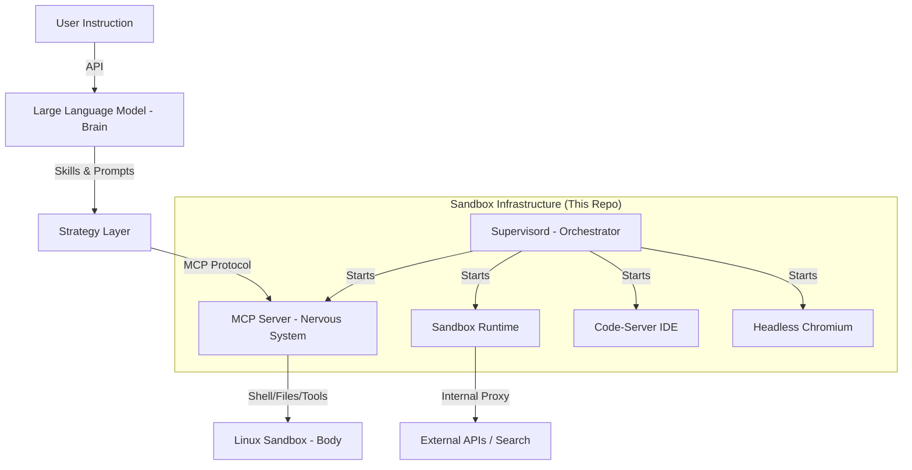

# ManusAgent: The Autonomous Agent Sandbox Architecture

This repository provides a comprehensive blueprint of the **Manus Agent** ecosystem—an autonomous AI agent environment built on Ubuntu 22.04. It reveals how an LLM (the Brain) orchestrates a sandboxed Linux environment (the Body) through a structured hierarchy of protocols and services.

---

## 🏗 System Architecture

The Manus Agent operates through a four-layer stack, managed by `systemd` and `supervisord`:



---

## 📂 Repository Structure & Components

### 1. Build & Provisioning (`build_layer/`)
- **`Dockerfile.template`**: Inferred build instructions for the Ubuntu 22.04 environment, including all necessary system dependencies (Chromium, Node.js, Python, X11).
- **`STARTUP_GUIDE.md`**: A step-by-step breakdown of how the system initializes from power-on to agent-ready state.

### 2. Orchestration & Management (`supervisor_conf/` & `scripts/`)
- **`supervisor_conf/`**: 10+ configuration files defining the service hierarchy.
  - `1-sandbox-runtime.conf`: The core agent controller.
  - `11-manus-mcp-server.conf`: The communication bridge for the LLM.
  - `7-code-server.conf`: The web-based VS Code environment.
- **`scripts/`**: Initialization scripts that handle environment pre-checks, dynamic password generation, and port binding.

### 3. Intelligence & Interaction (`skills_layer/` & `mcp_layer/`)
- **`skills_layer/`**: Modular "thinking templates" (Skills) that provide the LLM with procedural knowledge (e.g., how to create new skills or generate music prompts).
- **`mcp_layer/`**: Scripts to initialize the Model Context Protocol (MCP) server, allowing the LLM to execute secure shell commands and file operations.

### 4. Runtime API (`runtime_layer/`)
- **`data_api.py`**: A Python-based internal proxy client. It allows the agent to securely call external services (Search, LLM, etc.) via the `api.manus.im` gateway without exposing raw credentials to the sandbox.

---

## 🚀 How to Replicate & Start the Agent

### Step 1: Build the Container
Use the `build_layer/Dockerfile.template` to build your base image:
```bash
docker build -t manus-agent -f build_layer/Dockerfile.template .
```

### Step 2: Configure Environment
The agent requires specific environment variables injected at runtime:
- `RUNTIME_API_HOST`: The gateway for external API calls.
- `GH_TOKEN`: (Optional) For GitHub integration.
- `CODE_SERVER_PASSWORD`: Automatically generated by `scripts/check-start-code-server.sh`.

### Step 3: Launch Orchestration
The container's entrypoint is `supervisord`. It will automatically start services in the following priority:
1. **Core Runtime**: Must be healthy before other services start.
2. **MCP & Networking**: Enables the "Brain" to talk to the "Body".
3. **Tools & IDE**: Provides the user and agent with Chromium and VS Code.

---

## ⚙️ Configuration Matrix

| Component | Default Port | Config Path |
|---|---|---|
| **Code-Server** | `8329` | `~/.config/code-server/config.yaml` |
| **MCP Server** | `8350` | `supervisor_conf/11-manus-mcp-server.conf` |
| **Sandbox Runtime** | `8330` | `supervisor_conf/1-sandbox-runtime.conf` |
| **VNC / Desktop** | `5900` | `supervisor_conf/5-x11vnc.conf` |

---

## 🛡 Security & Isolation
The environment is designed as a **restricted sandbox**. 
- **User**: Runs as a non-root `ubuntu` user for all tool executions.
- **Network**: All external calls are proxied through the `Runtime API` layer for monitoring and safety.
- **Persistence**: Temporary filesystem that resets after the session ends (unless configured otherwise).
