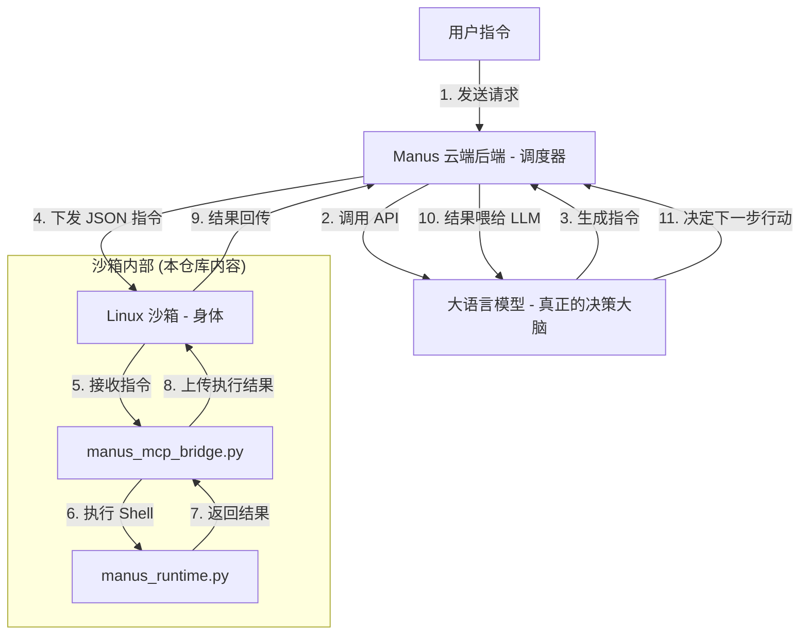

# ManusAgent: 全源码自主 AI Agent 架构复刻与部署白皮书

本仓库提供了一个**完全开源、全源码实现**的 Manus Agent 架构。通过逆向分析原有的私有二进制组件，我们使用 Python 重新实现了核心运行时和协议桥接器，彻底消除了“二进制黑盒”。

---

## 🏗 一、全景架构解析：为什么看不到 LLM 调用？

您的观察非常敏锐：**在沙箱内部确实看不到直接调用 OpenAI/Claude API 的代码。** 这是因为 Manus 采用了典型的 **“云端大脑 (Cloud Brain) + 边缘身体 (Edge Body)”** 的分布式架构。

### 1. 核心架构图 (逻辑流转)



---

## 🚀 二、实战运行：接入真实大模型 (LLM)

如果您希望复现一个**真正能自主思考并操作电脑**的 Agent，请按照以下步骤操作。我们已经为您编写了 `real_llm_brain.py` 脚本，它将作为“外部大脑”指挥沙箱执行任务。

### 1. 准备 API Key
支持 OpenAI、Claude 或任何兼容 OpenAI 格式的 API（如 DeepSeek、智谱 AI 等）。

```bash
# 设置环境变量 (推荐)
export OPENAI_API_KEY="sk-xxxx"
export OPENAI_BASE_URL="https://api.openai.com/v1"
```

### 2. 运行实战大脑
确保 `manus_runtime.py` 已在 8330 端口启动，然后运行：
```bash
# 运行实战大脑并下达任务
python3 real_llm_brain.py "帮我查看当前目录下的文件，并创建一个 test.txt"
```

### 3. 运行逻辑
- **大脑决策**: `real_llm_brain.py` 调用大模型，产生一个 MCP 格式的 JSON 指令。
- **身体执行**: 指令通过管道发送给 `manus_mcp_bridge.py`，再调用 `manus_runtime.py` 执行 shell。
- **反馈闭环**: 执行结果返回给大模型，大模型决定下一步是继续执行还是结束任务。

---

## 📂 三、核心开源组件说明

- **`runtime_layer/manus_runtime.py`**: 核心运行时，提供健康检查、API 代理转发和 Shell 执行接口。
- **`mcp_layer/manus_mcp_bridge.py`**: MCP 协议桥接器，实现 LLM 指令到 Shell 命令的精准映射。
- **`real_llm_brain.py`**: 实战版外部大脑，负责思考、决策与指令下发（需 API Key）。
- **`simulate_llm_brain.py`**: 模拟版外部大脑，用于本地测试协议连通性（无需 API Key）。

---

## 🛠 四、保姆级部署指南

### 1. 环境准备 (Ubuntu 22.04+)
```bash
sudo apt-get update && sudo apt-get install -y python3-pip curl
pip install fastapi uvicorn requests
```

### 2. 部署步骤
1. **克隆代码**: `git clone https://github.com/ctz168/manusagent.git`
2. **启动运行时 (Terminal 1)**: `python3 runtime_layer/manus_runtime.py`
3. **启动实战大脑 (Terminal 2)**: `python3 real_llm_brain.py "你的任务描述"`

---

## 🛡️ 为什么这个版本更适合您？
- **全闭环复现**: 从大脑决策到身体执行，提供了完整的代码链路。
- **零黑盒**: 每一行 Python 代码都清晰可见，方便二次开发。
- **高度兼容**: 只要支持 OpenAI 格式的 API 即可一键接入。

如果您有任何逻辑优化或功能扩展建议，欢迎提交 PR！
