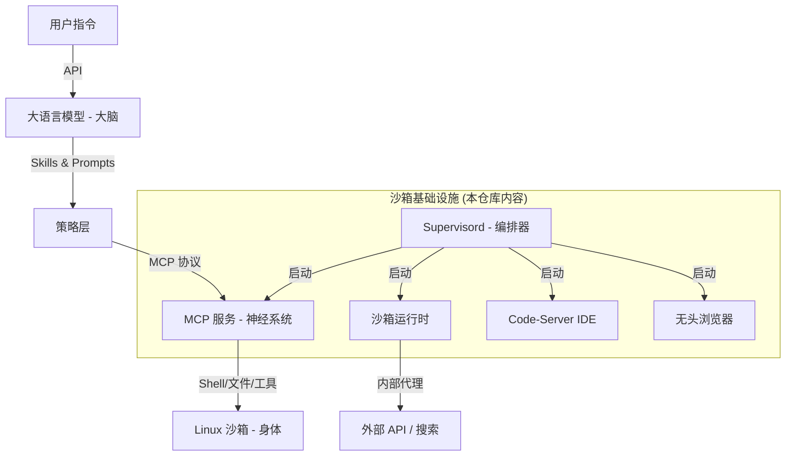

# ManusAgent: 自主 AI Agent 沙箱架构与部署指南

本仓库提供了一个完整的 **Manus Agent** 生态系统蓝图。这是一个基于 Ubuntu 22.04 的自主 AI Agent 环境，揭示了大模型（大脑）如何通过结构化的协议和服务层来操控沙箱环境（身体）。

---

## 🏗 系统架构图

Manus Agent 采用四层架构，由 `systemd` 和 `supervisord` 统一管理：



---

## 📂 仓库结构说明

### 1. 构建与环境层 (`build_layer/`)
- **`Dockerfile.template`**: 还原了 Ubuntu 22.04 沙箱环境的构建指令，包含 Chromium, Node.js, Python, X11 等核心依赖。
- **`STARTUP_GUIDE.md`**: 详细描述了系统从开机到 Agent 就绪的完整初始化流程。

### 2. 编排与管理层 (`supervisor_conf/` & `scripts/`)
- **`supervisor_conf/`**: 包含服务配置文件，定义了服务的优先级和重启策略。
- **`scripts/`**: 包含环境预备脚本。注意：`check-start-code-server.sh` 依赖于 `sandbox-runtime` 的健康状态。

### 3. 智能交互层 (`skills_layer/` & `mcp_layer/`)
- **`skills_layer/`**: 模块化的“思维模板”（Skills），为 LLM 提供特定领域的程序化知识。
- **`mcp_layer/`**: MCP 服务启动脚本，是大模型执行 Shell 命令和文件操作的核心桥梁。

---

## 🚀 部署与运行指南（复现必读）

### ⚠️ 重要说明：私有组件
本仓库包含了 Manus 的**架构编排**、**启动脚本**和**配置逻辑**。但请注意：
1.  **核心运行时 (`start_server`)**: 这是一个专有的二进制执行文件，负责管理沙箱状态。复现时，您需要将其替换为您自己的 Agent 运行时逻辑。
2.  **MCP CLI (`manus-mcp-cli`)**: 同样是专有组件，负责协议解析。

### 第一步：构建容器镜像
参考 `build_layer/Dockerfile.template` 构建基础镜像：
```bash
docker build -t manus-agent -f build_layer/Dockerfile.template .
```

### 第二步：配置与启动
1.  将 `supervisor_conf/*.conf` 放入容器的 `/etc/supervisor/conf.d/`。
2.  将 `scripts/` 和 `mcp_layer/` 中的脚本放入 `/opt/.manus/.packages/scripts/` 并赋予执行权限。
3.  **核心关键**：确保您的运行时服务监听在 `8330` 端口，并提供 `/healthz` 接口。因为 Code-Server 和 MCP 服务会通过该接口判断系统是否就绪。

### 第三步：运行
容器启动后运行 `supervisord`，它会自动按顺序拉起所有组件。

---

## ⚙️ 关键配置矩阵

| 组件 | 默认端口 | 配置文件路径 |
|---|---|---|
| **Code-Server** | `8329` | `~/.config/code-server/config.yaml` |
| **MCP Server** | `8350` | `supervisor_conf/11-manus-mcp-server.conf` |
| **Sandbox Runtime** | `8330` | `supervisor_conf/1-sandbox-runtime.conf` |

---

## 🛡️ 安全与隔离
- **权限限制**: 所有工具执行均以非 root 用户 `ubuntu` 运行。
- **网络隔离**: 所有外部 API 调用均建议通过代理层进行审计。
