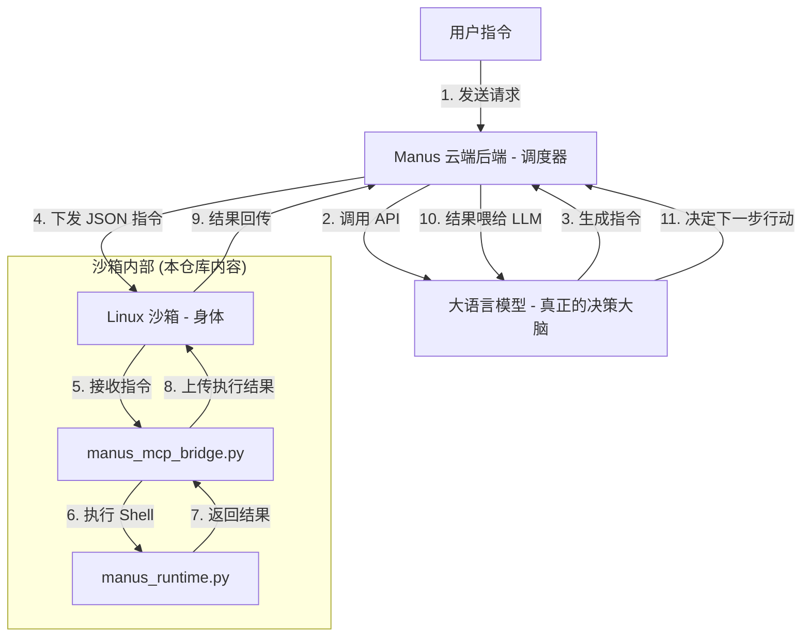

# ManusAgent: 全源码自主 AI Agent 架构复刻与部署白皮书

本仓库提供了一个**完全开源、全源码实现**的 Manus Agent 架构。通过逆向分析原有的私有二进制组件，我们使用 Python 重新实现了核心运行时和协议桥接器，彻底消除了“二进制黑盒”。

---

## 🏗 一、全景架构解析：为什么看不到 LLM 调用？

您的观察非常敏锐：**在沙箱内部确实看不到直接调用 OpenAI/Claude API 的代码。** 这是因为 Manus 采用了典型的 **“云端大脑 (Cloud Brain) + 边缘身体 (Edge Body)”** 的分布式架构。

### 1. 核心架构图 (逻辑流转)



### 2. 为什么要这么设计？
- **安全性**: 敏感的 API Key (如 OpenAI Key) 存储在云端后端，不会下发到用户可接触的沙箱环境中，防止泄露。
- **持久性**: 即使沙箱因为网络波动断开，云端的 LLM 状态依然可以保持，待沙箱重连后继续任务。
- **性能**: LLM 调用通常耗时较长，由云端异步处理可以更好地管理队列和并发。

---

## 🛠 二、源码逻辑深度解析

### 1. 运行时逻辑 (`runtime_layer/manus_runtime.py`)
- **健康检查 (`/healthz`)**: 返回系统版本和状态。这是 Code-Server 和其他监控组件判断 Agent 是否就绪的唯一标准。
- **API 代理 (`/apiproxy.v1.ApiProxyService/CallApi`)**: 模拟与后端 API 网关的交互。在全源码版中，您可以根据 `apiId` 自定义任何外部服务的调用逻辑。
- **工具执行 (`/execute`)**: 使用 `asyncio.create_subprocess_shell` 安全地异步执行命令，并实时捕获 `stdout` 和 `stderr`。

### 2. 协议桥接逻辑 (`mcp_layer/manus_mcp_bridge.py`)
- **标准输入流 (stdin)**: 持续监听来自 LLM 的指令流。
- **方法映射**: 目前支持 `shell/run`（执行命令）和 `system/status`（获取状态）。
- **JSON-RPC 响应**: 严格遵循 MCP 协议格式，确保大模型能够正确解析执行结果。

---

## 🚀 三、模拟“外部大脑”运行示例

为了让您直观地看到这个循环是如何转起来的，我编写了一个模拟脚本 `simulate_llm_brain.py`。它模拟了云端后端如何向沙箱发送指令：

1. **大脑决策**: "我需要知道当前系统时间。"
2. **下发指令**: 向 `manus_mcp_bridge.py` 发送 `{"method": "shell/run", "params": {"command": "date"}}`。
3. **接收结果**: 拿到沙箱返回的时间。
4. **下一步行动**: "时间已拿到，任务完成。"

---

## ⚙️ 四、保姆级部署指南

### 1. 环境准备 (Ubuntu 22.04+)
首先，确保您的系统中安装了必要的 Python 依赖：
```bash
# 更新系统并安装基础工具
sudo apt-get update && sudo apt-get install -y python3-pip net-tools curl

# 安装 Web 服务框架
pip install fastapi uvicorn requests
```

### 2. 部署步骤
1. **克隆代码**:
   ```bash
   git clone https://github.com/ctz168/manusagent.git
   cd manusagent
   ```

2. **启动核心运行时 (Terminal 1)**:
   ```bash
   python3 runtime_layer/manus_runtime.py
   ```

3. **启动协议桥接器并运行模拟大脑 (Terminal 2)**:
   ```bash
   # 启动桥接器并使用模拟脚本发送指令
   python3 simulate_llm_brain.py
   ```

---

## 🤝 贡献与扩展
本仓库是完全透明的开源实现。如果您发现了逻辑上的优化空间，或者希望增加更多的 MCP 方法支持，欢迎提交 Pull Request！
