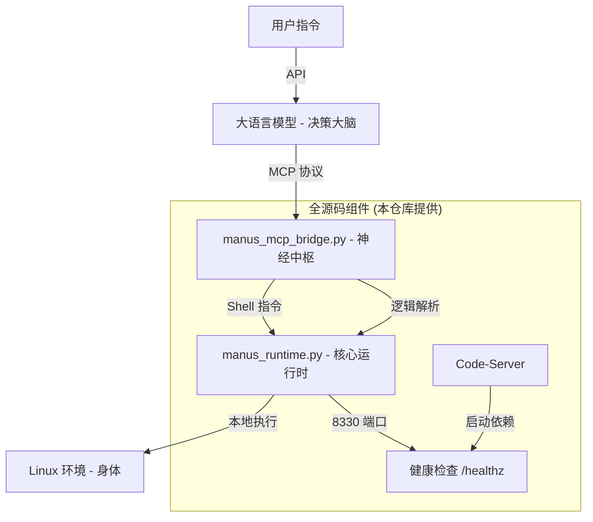

# ManusAgent: 全源码自主 AI Agent 架构复刻与部署白皮书

本仓库提供了一个**完全开源、全源码实现**的 Manus Agent 架构。通过逆向分析原有的私有二进制组件，我们使用 Python 重新实现了核心运行时和协议桥接器，彻底消除了“二进制黑盒”。本指南将带您从零开始，在标准的 Ubuntu 环境中复刻并运行这套自主 Agent 系统。

---

## 🏗 一、全景架构解析

Manus Agent 的核心逻辑在于“大脑（LLM）”与“身体（沙箱）”的解耦。其运行机制如下：



### 1. 核心组件功能
- **`manus_runtime.py`**: 模拟 Manus 专有的 `start_server`。它是整个沙箱的“心脏”，负责提供健康检查、API 代理转发以及最终的 Shell 命令执行。
- **`manus_mcp_bridge.py`**: 模拟 `manus-mcp-cli`。它实现了标准的 **Model Context Protocol (MCP)**，将 LLM 的 JSON 指令（如 `shell/run`）精准映射为本地命令。

---

## 🛠 二、源码逻辑深度解析

### 1. 运行时逻辑 (`runtime_layer/manus_runtime.py`)
- **健康检查 (`/healthz`)**: 返回系统版本和状态。这是 Code-Server 和其他监控组件判断 Agent 是否就绪的唯一标准。
- **API 代理 (`/apiproxy.v1.ApiProxyService/CallApi`)**: 模拟与后端 API 网关的交互。在全源码版中，您可以根据 `apiId` 自定义任何外部服务的调用逻辑。
- **工具执行 (`/execute`)**: 使用 `asyncio.create_subprocess_shell` 安全地异步执行命令，并实时捕获 `stdout` 和 `stderr`。

### 2. 协议桥接逻辑 (`mcp_layer/manus_mcp_bridge.py`)
- **标准输入流 (stdin)**: 持续监听来自 LLM 的指令流。
- **方法映射**: 目前支持 `shell/run`（执行命令）和 `system/status`（获取状态）。
- **JSON-RPC 响应**: 严格遵循 MCP 协议格式，确保大模型能够正确解析执行结果。

---

## 🚀 三、保姆级部署指南

### 1. 环境准备 (Ubuntu 22.04+)
首先，确保您的系统中安装了必要的 Python 依赖：
```bash
# 更新系统并安装基础工具
sudo apt-get update && sudo apt-get install -y python3-pip net-tools curl

# 安装 Web 服务框架
pip install fastapi uvicorn requests
```

### 2. 部署步骤
1. **克隆代码**:
   ```bash
   git clone https://github.com/ctz168/manusagent.git
   cd manusagent
   ```

2. **启动核心运行时 (Terminal 1)**:
   ```bash
   python3 runtime_layer/manus_runtime.py
   ```
   *此时系统会监听 `0.0.0.0:8330`。*

3. **启动协议桥接器 (Terminal 2)**:
   ```bash
   python3 mcp_layer/manus_mcp_bridge.py
   ```

4. **启动可视化 IDE (可选)**:
   确保 8330 端口已就绪后，运行：
   ```bash
   bash scripts/check-start-code-server.sh
   ```

---

## ⚙️ 四、配置与运行细节

### 1. 端口矩阵
| 组件 | 端口 | 说明 |
|---|---|---|
| **Runtime** | `8330` | 核心 API 与健康检查 |
| **Code-Server** | `8329` | 网页版 VS Code 界面 |
| **MCP Bridge** | 管道/标准输入 | 与 LLM 交互的通讯协议 |

### 2. 如何验证运行成功？
- **方法 A**: 访问 `http://localhost:8330/healthz`，应返回 `{"status": "ok"}`。
- **方法 B**: 在另一个终端执行测试指令：
  ```bash
  curl -X POST http://localhost:8330/execute -H "Content-Type: application/json" -d '{"command": "echo Hello Manus"}'
  ```

---

## 🛡️ 五、常见问题排查 (FAQ)

**Q: 为什么 Code-Server 启动不了？**
A: 请检查 `manus_runtime.py` 是否已在 8330 端口启动。启动脚本会轮询该端口，直到检测到 `/healthz` 返回成功。

**Q: 我可以修改执行命令的权限吗？**
A: 可以。在 `manus_runtime.py` 的 `execute_tool` 函数中，您可以增加任何权限控制逻辑（如限制某些高危命令）。

**Q: 如何让系统在后台持续运行？**
A: 推荐使用本仓库 `supervisor_conf/` 目录下的配置文件，通过 `supervisord` 进行生产级管理。

---

## 🤝 贡献与扩展
本仓库是完全透明的开源实现。如果您发现了逻辑上的优化空间，或者希望增加更多的 MCP 方法支持，欢迎提交 Pull Request！
