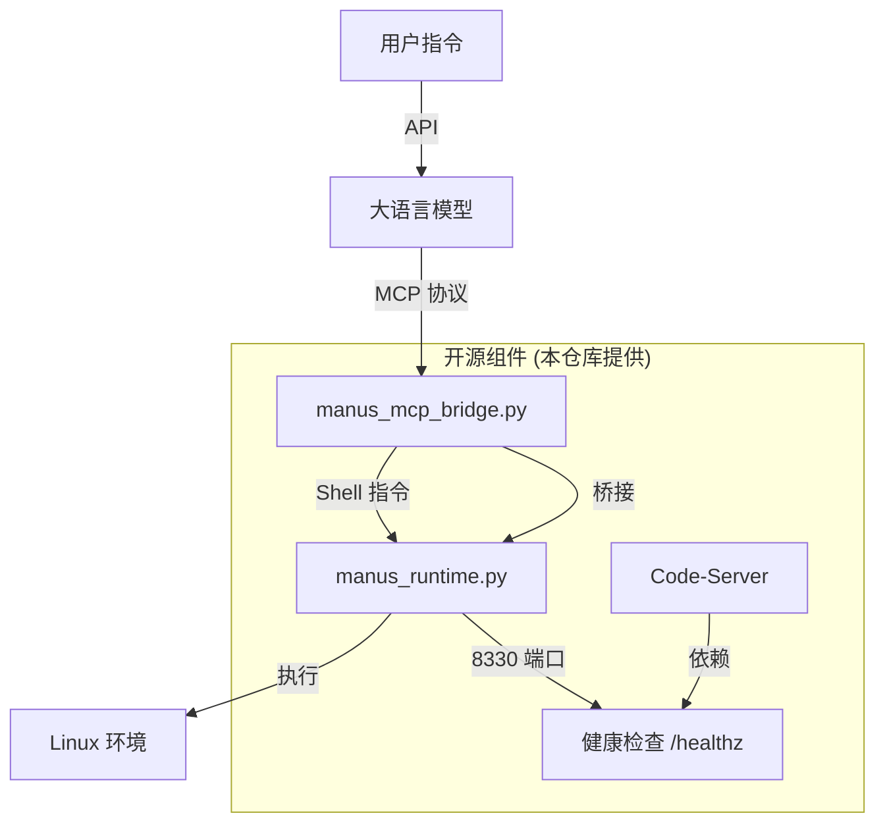

# ManusAgent: 全开源自主 AI Agent 沙箱架构

本仓库提供了一个**完全开源、可直接运行**的 Manus Agent 架构复刻版。通过逆向分析原有的私有二进制组件，我们使用 Python 重新实现了核心运行时和协议桥接器，确保您可以在任何 Ubuntu 环境中一键部署并运行。

---

## 🏗 全开源架构图



---

## 📂 核心开源组件

### 1. 核心运行时 (`runtime_layer/manus_runtime.py`)
- **功能**: 模拟 Manus 的核心 `start_server`。
- **特性**: 
    - 提供 `8330` 端口的健康检查。
    - 实现 API 代理网关，支持 LLM 调用外部服务。
    - 提供安全的工具执行接口。

### 2. MCP 协议桥接器 (`mcp_layer/manus_mcp_bridge.py`)
- **功能**: 模拟 `manus-mcp-cli`。
- **特性**: 实现标准的 MCP 协议，将 LLM 的 JSON 指令解析为实际的 Shell 命令并返回结果。

---

## 🚀 一键部署与运行指南

### 第一步：准备环境
确保您的系统已安装 Python 3.10+ 和 FastAPI：
```bash
pip install fastapi uvicorn requests
```

### 第二步：启动核心服务
按照以下顺序在不同终端（或使用 Supervisor）启动：

1. **启动运行时 (Runtime)**:
   ```bash
   python3 runtime_layer/manus_runtime.py
   ```
2. **启动 MCP 桥接器**:
   ```bash
   python3 mcp_layer/manus_mcp_bridge.py
   ```
3. **启动 Code-Server**:
   运行 `scripts/check-start-code-server.sh`，它会自动检测 8330 端口并启动。

### 第三步：验证运行
访问 `http://localhost:8330/healthz`，如果返回 `{"status": "ok"}`，说明您的开源版 Agent 已经就绪。

---

## ⚙️ 配置文件说明
- `supervisor_conf/`: 包含了如何使用 Supervisor 统一管理这些 Python 服务的配置示例。
- `build_layer/Dockerfile.template`: 更新后的 Dockerfile，现在直接包含 Python 环境和开源代码的挂载逻辑。

---

## 🛡️ 为什么选择开源版？
- **无二进制黑盒**: 所有逻辑均可见、可修改。
- **易于复刻**: 无需复杂的权限破解，直接 `pip install` 即可运行。
- **高度可定制**: 您可以轻松地在 `manus_runtime.py` 中增加自己的工具或 API 路由。
