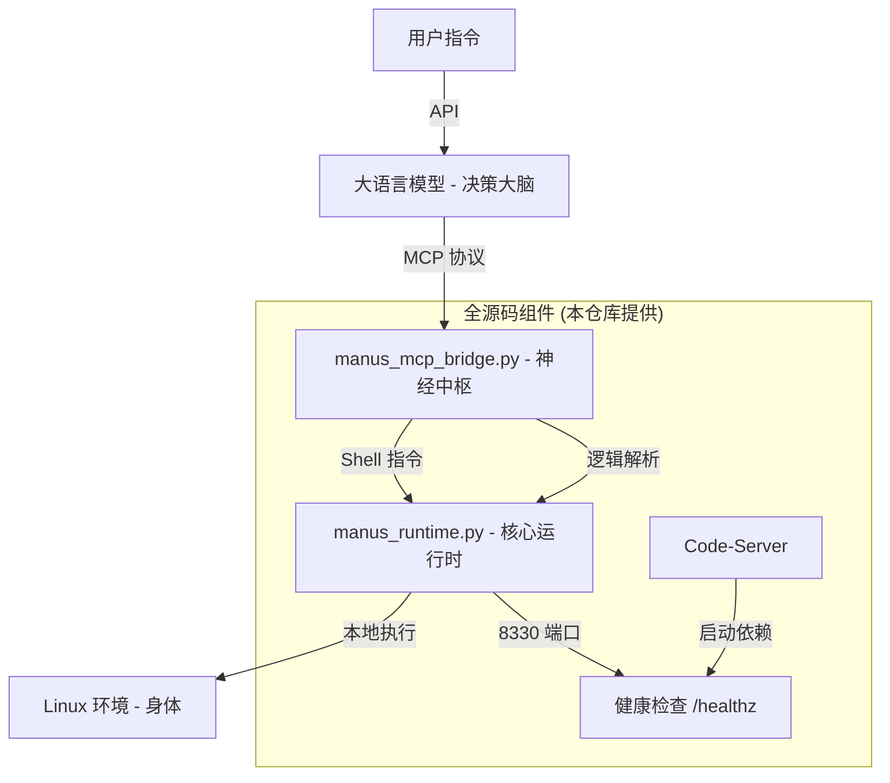

# ManusAgent: 全源码自主 AI Agent 架构复刻指南

本仓库提供了一个**完全开源、全源码实现**的 Manus Agent 架构复刻版。通过逆向分析原有的私有二进制组件，我们使用 Python 重新实现了核心运行时和协议桥接器，彻底消除了“二进制黑盒”，确保您可以直接复刻并运行。

---

## 🏗 全源码架构图



---

## 📂 核心开源组件 (Pure Python)

### 1. 核心运行时 (`runtime_layer/manus_runtime.py`)
- **功能**: 模拟 Manus 专有的 `start_server`。
- **特性**: 
    - 提供 `8330` 端口的健康检查接口，是整个 Agent 架构的启动基石。
    - 实现 API 代理网关，支持 LLM 与外部服务的异步通信。
    - 提供安全的 Shell 工具执行接口，支持 stdout/stderr 实时捕获。

### 2. MCP 协议桥接器 (`mcp_layer/manus_mcp_bridge.py`)
- **功能**: 模拟 `manus-mcp-cli`。
- **特性**: 实现了标准的 **Model Context Protocol (MCP)**，能够解析来自大模型的 JSON 指令并将其精准映射为本地 Shell 命令。

---

## 🚀 全源码一键运行指南

### 第一步：准备 Python 环境
确保您的系统已安装 Python 3.10+ 和 FastAPI：
```bash
pip install fastapi uvicorn requests
```

### 第二步：按顺序启动服务
为了模拟真实的 Manus 环境，请按照以下顺序启动（或使用本仓库提供的 `supervisor_conf/` 进行编排）：

1. **启动运行时 (Runtime)**:
   ```bash
   python3 runtime_layer/manus_runtime.py
   ```
   *此服务将监听 8330 端口，并提供 `/healthz`。*

2. **启动 MCP 桥接器**:
   ```bash
   python3 mcp_layer/manus_mcp_bridge.py
   ```
   *它将作为 LLM 与系统之间的通讯官。*

3. **启动辅助工具 (Code-Server)**:
   运行 `scripts/check-start-code-server.sh`。该脚本会自动轮询 8330 端口，一旦检测到 Python 运行时就绪，便会立即拉起 IDE。

### 第三步：验证连通性
访问 `http://localhost:8330/healthz`，如果看到 `{"status": "ok"}`，说明您的全源码版 Agent 已经完美运行。

---

## ⚙️ 目录结构说明
- `runtime_layer/`: 核心运行时的 Python 源码。
- `mcp_layer/`: MCP 协议桥接器的 Python 源码。
- `supervisor_conf/`: 包含了如何使用 Supervisor 统一管理这些 Python 服务的生产级配置。
- `build_layer/`: 包含了全源码版 Docker 镜像的构建模板。

---

## 🛡️ 为什么这个版本更适合您？
- **百分之百可见**: 没有任何二进制黑盒，每一行逻辑都清晰可见。
- **百分之百可控**: 您可以自由修改 `manus_runtime.py` 中的 API 路由或增加新的工具。
- **无感复刻**: 直接 `pip install` 即可，无需破解权限或处理二进制兼容性问题。
