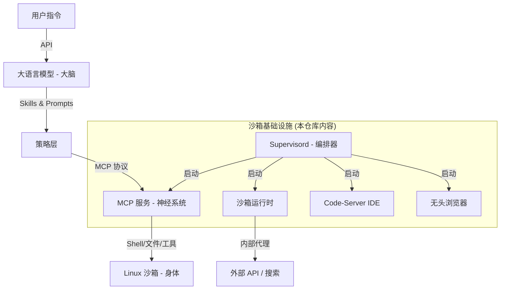

# ManusAgent: 自主 AI Agent 沙箱架构与部署指南

本仓库提供了一个完整的 **Manus Agent** 生态系统蓝图。这是一个基于 Ubuntu 22.04 的自主 AI Agent 环境，揭示了大模型（大脑）如何通过结构化的协议和服务层来操控沙箱环境（身体）。

---

## 🏗 系统架构图

Manus Agent 采用四层架构，由 `systemd` 和 `supervisord` 统一管理：



---

## 📂 仓库结构说明

### 1. 构建与环境层 (`build_layer/`)
- **`Dockerfile.template`**: 还原了 Ubuntu 22.04 沙箱环境的构建指令，包含 Chromium, Node.js, Python, X11 等核心依赖。
- **`STARTUP_GUIDE.md`**: 详细描述了系统从开机到 Agent 就绪的完整初始化流程。

### 2. 编排与管理层 (`supervisor_conf/` & `scripts/`)
- **`supervisor_conf/`**: 包含 10 多个服务配置文件，定义了服务的优先级和重启策略。
- **`scripts/`**: 包含环境预检、动态密码生成（用于 Code-Server）和端口绑定的初始化脚本。

### 3. 智能交互层 (`skills_layer/` & `mcp_layer/`)
- **`skills_layer/`**: 模块化的“思维模板”（Skills），为 LLM 提供特定领域的程序化知识。
- **`mcp_layer/`**: MCP 服务启动脚本，是大模型执行 Shell 命令和文件操作的核心桥梁。

### 4. 运行时 API 层 (`runtime_layer/`)
- **`data_api.py`**: Python 编写的内部代理客户端，用于安全地调用外部搜索、模型等 API，而无需在沙箱内暴露原始密钥。

---

## 🚀 部署与运行指南

### 第一步：构建容器镜像
参考 `build_layer/Dockerfile.template` 构建基础镜像：
```bash
docker build -t manus-agent -f build_layer/Dockerfile.template .
```

### 第二步：配置环境变量
Agent 运行需要注入以下关键变量：
- `RUNTIME_API_HOST`: 内部 API 网关地址（默认为 `https://api.manus.im`）。
- `CODE_SERVER_PASSWORD`: 由脚本自动生成，也可手动指定。
- `GH_TOKEN`: (可选) 用于 GitHub 集成。

### 第三步：启动服务编排
容器的入口点（Entrypoint）应设为 `supervisord`。它会按照以下优先级启动服务：
1. **核心运行时 (Sandbox-Runtime)**: 必须首先启动并健康检查通过。
2. **MCP 协议服务**: 开启后，大模型即可通过此通道下达指令。
3. **工具与 IDE 层**: 启动无头浏览器和 Code-Server 供用户或 Agent 使用。

---

## ⚙️ 关键配置矩阵

| 组件 | 默认端口 | 配置文件路径 |
|---|---|---|
| **Code-Server** | `8329` | `~/.config/code-server/config.yaml` |
| **MCP Server** | `8350` | `supervisor_conf/11-manus-mcp-server.conf` |
| **Sandbox Runtime** | `8330` | `supervisor_conf/1-sandbox-runtime.conf` |
| **VNC 桌面** | `5900` | `supervisor_conf/5-x11vnc.conf` |

---

## 🛡️ 安全与隔离
- **权限限制**: 所有工具执行均以非 root 用户 `ubuntu` 运行。
- **网络隔离**: 所有外部 API 调用均通过 `Runtime API` 层进行代理和审计。
- **持久化**: 默认为临时文件系统，会话结束即重置。
